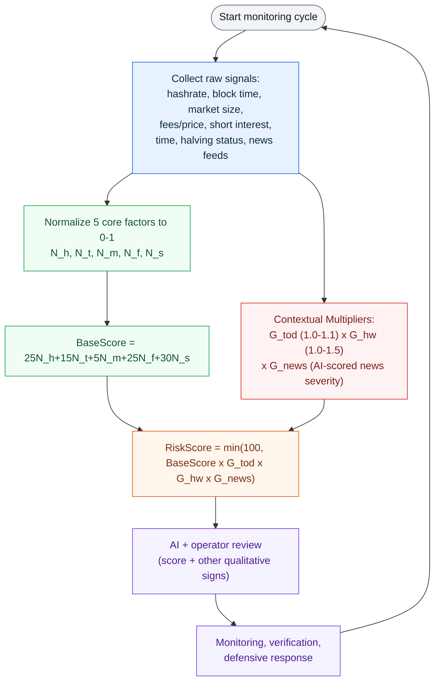

# Bitcoin 51% Attack Risk Monitor

The way to detect and mitigate 51% attacks on bitcoin blockchain, our project is a defensive monitoring program for Bitcoin
chain continuity and double-spend risk. It collects direct blockchain evidence,
network and market context, block-timing statistics, and outage-related news,
then produces:

- a risk level and evidence score from 0 to 100;
- the important data points behind the assessment;
- data-source and node-health information;
- deterministic defensive recommendations; and
- an optional AI-written review.

The project and its monitoring model are based on the research paper included
with the project.

> The evidence score is a monitoring indicator, not the probability that an
> attack is occurring. An alert should be verified across independent Bitcoin
> Core nodes before operational action is taken.

## How the project works

Each monitoring cycle follows five stages:

1. **Collect direct chain evidence.** The monitor queries independently hosted
   Bitcoin Core nodes for their tips, chainwork, recent history, competing
   branches, reorganizations, and optional wallet transaction removals.
2. **Collect supporting context.** Public chain data, block intervals,
   hashrate, mining-pool concentration, hashpower-market information, BCH
   market information, Bitfinex margin positions, halving proximity, UTC time
   windows, and regional outage news are collected.
3. **Check agreement and data quality.** Core nodes are compared with one
   another and with independent public chain references. Missing, stale, or
   disagreeing sources are reported instead of being silently treated as safe.
4. **Assess risk.** Deterministic rules evaluate direct attack signals,
   statistical block-time anomalies, and contextual indicators. Direct chain
   evidence controls the strongest alerts.
5. **Recommend a response.** The report explains why the score was assigned and
   suggests monitoring, verification, confirmation, or settlement controls. If
   enabled, AI adds a concise operator review without changing the deterministic
   result.

### Research-based algorithm



The normalized research factors are:

| Symbol | Signal |
| --- | --- |
| `N_h` | Network hashrate pressure |
| `N_t` | Block-time anomaly |
| `N_m` | Hashpower-market size |
| `N_f` | Fee and price relationship |
| `N_s` | Short-interest and market-positioning signal |

The contextual multipliers are:

| Symbol | Context |
| --- | --- |
| `G_tod` | Monitored UTC time-of-day windows |
| `G_hw` | Halving-week context |
| `G_news` | AI-scored news severity |

The research score is bounded to 100:

```text
BaseScore = 25N_h + 15N_t + 5N_m + 25N_f + 30N_s
RiskScore = min(100, BaseScore × G_tod × G_hw × G_news)
```

## Runtime risk assessment

The program reports an `evidence_score` from 0 to 100 together with an alert
level. The score is traceable: every applied rule appears in
`score_components` with its signal, category, points, rule, and explanation.

Direct chain signals include:

- observed chain reorganizations and their detached depth;
- disagreement between healthy Bitcoin Core nodes;
- validated competing branches;
- non-increasing chainwork or an unexplained tip discontinuity;
- wallet transactions removed by a reorganization;
- Core nodes lagging independent public references; and
- hash disagreement at a common block height.

Supporting signals include:

- current block age and recent block intervals;
- estimated hashrate changes;
- mining-pool concentration;
- hashpower-market activity;
- BCH market information;
- Bitfinex margin positions;
- regional electricity-outage news;
- halving proximity; and
- monitored UTC time windows.

The alert level is not determined by the score alone. Strong direct evidence can
raise the level immediately, while incomplete direct-chain data produces an
`unknown` result.

| Level | Meaning | Default operational guidance |
| --- | --- | --- |
| `unknown` | Direct evidence or node quorum is incomplete | Restore and verify data sources |
| `normal` | No material anomaly is visible | Continue normal monitoring |
| `watch` | Anomalies require closer inspection | Increase monitoring and verify chain signals |
| `warning` | Direct or combined evidence warrants controls | Manually review large deposits and increase confirmations |
| `critical` | Strong direct evidence requires incident response | Pause automatic settlement and begin the incident runbook |

The report also provides `data_quality`, `confirmation_multiplier`, and
`pause_settlement` fields so downstream systems can apply explicit safeguards.

## Data sources

The monitor uses:

- one or more Bitcoin Core JSON-RPC endpoints;
- Blockchain.com public chain, hashrate, and mining-pool data;
- mempool.space common-height block hashes;
- Blockchair recent Bitcoin blocks and BCH statistics;
- NiceHash public SHA256 market data;
- Bitfinex public margin-position data;
- NewsAPI when `NEWS_API_KEY` is configured; otherwise the keyless GDELT
  fallback; and
- OpenAI only when the optional AI advisory is enabled.

Each observation includes a status such as `ok`, `partial`, `unavailable`,
`stale`, or `error`. A failed supporting source degrades the report instead of
stopping the entire monitoring cycle.

## Requirements

- Python 3.11 or newer
- Internet access for public data sources
- Bitcoin Core JSON-RPC access for direct chain monitoring
- At least two independently hosted and peered Bitcoin Core nodes for quorum
  checks
- An OpenAI API key only if AI recommendations are required

## Installation

### Standard Python installation

```powershell
python -m venv .venv
.\.venv\Scripts\Activate.ps1
python -m pip install --upgrade pip
python -m pip install -e .
```

Install the optional AI and test dependencies:

```powershell
python -m pip install -e ".[ai,test]"
```

### Using uv

```powershell
uv sync --extra ai --extra test
```

The core monitor works without the optional OpenAI package and without an
OpenAI API key.

## Bitcoin Core configuration

Provide comma-separated RPC URLs for independently hosted Bitcoin Core nodes:

```powershell
$env:BITCOIN_RPC_URLS = "http://node-a:8332/,http://node-b:8332/"
$env:MINIMUM_HEALTHY_NODES = "2"
```

Use dedicated RPC credentials, restrict RPC access with a firewall, and never
expose a Bitcoin Core RPC endpoint directly to the public internet.

With no configured Core nodes, the program can still display public and
contextual data, but the risk level is `unknown`. A single node is useful for
development, but it cannot establish cross-node agreement.

### Optional wallet reorganization checks

```powershell
$env:MONITOR_WALLET_TRANSACTIONS = "true"
$env:WALLET_TARGET_CONFIRMATIONS = "6"
```

The RPC URL must address a loaded watch-only or descriptor wallet when wallet
monitoring is enabled.

## Environment variables

| Variable | Default | Purpose |
| --- | ---: | --- |
| `BITCOIN_RPC_URLS` | unset | Comma-separated Bitcoin Core RPC URLs |
| `BITCOIN_RPC_USER` | unset | Shared RPC username |
| `BITCOIN_RPC_PASSWORD` | unset | Shared RPC password |
| `BITCOIN_NETWORK` | `main` | Expected Bitcoin Core chain |
| `MINIMUM_HEALTHY_NODES` | `2` | Required healthy-node quorum |
| `BLOCK_DETECTOR_STATE_PATH` | `.block_detector_state.json` | Persistent chain cursor and tip state |
| `MONITOR_WALLET_TRANSACTIONS` | `false` | Enable wallet reorganization checks |
| `WALLET_TARGET_CONFIRMATIONS` | `6` | Wallet cursor confirmation target |
| `EXPECTED_BLOCK_MINUTES` | `10` | Mean used by the timing model |
| `TIMING_WATCH_TAIL` | `0.05` | Block-time watch-tail threshold |
| `TIMING_WARNING_TAIL` | `0.01` | Block-time warning-tail threshold |
| `TIMING_CRITICAL_TAIL` | `0.001` | Block-time extreme-tail threshold |
| `BLOCK_HISTORY_LIMIT` | `24` | Number of recent blocks requested |
| `MAX_REORG_SEARCH_DEPTH` | `144` | Maximum stored-history reorg search |
| `PUBLIC_HEIGHT_LAG_BLOCKS` | `3` | Core/public height-gap watch threshold |
| `CORE_ABSOLUTE_STALE_MINUTES` | `180` | Unreconciled Core tip-age threshold |
| `POLL_SECONDS` | `30` | Default monitoring interval |
| `REPEAT_ALERT_SECONDS` | `900` | Repeated-alert cooldown |
| `REQUEST_CONNECT_TIMEOUT` | `3.05` | HTTP connection timeout in seconds |
| `REQUEST_READ_TIMEOUT` | `10` | HTTP response timeout in seconds |
| `NEWS_API_KEY` | unset | Use NewsAPI instead of the GDELT fallback |
| `BLOCKCHAIR_API_KEY` | unset | Optional Blockchair API key |
| `OPENAI_API_KEY` | unset | Enable the optional AI advisory |
| `OPENAI_MODEL` | `gpt-5.6-luna` | Model used for the AI advisory |

Environment variables must be set in the shell or loaded by the process manager
that starts the monitor. The program does not automatically load a `.env` file.

## Usage

### Display the current risk report

After installation:

```powershell
block-detector
```

From the source tree:

```powershell
python -m block_detector
```

Both commands collect a new snapshot and display the current score, risk level,
important observations, data quality, reasons, and recommendations.

### Disable the AI request

```powershell
block-detector report --no-ai
```

### Return the complete report as JSON

```powershell
block-detector report --json
```

### Collect a deterministic JSON snapshot

```powershell
block-detector snapshot
```

For compact JSON:

```powershell
block-detector snapshot --compact
```

### Continuously monitor risk

```powershell
block-detector monitor
```

Use a custom polling interval:

```powershell
block-detector monitor --interval 60
```

Run one monitoring cycle:

```powershell
block-detector monitor --once
```

Print every complete snapshot instead of only alert transitions:

```powershell
block-detector monitor --all-snapshots
```

Stop continuous monitoring with `Ctrl+C`.

## AI recommendations

AI recommendations are optional. Install the `ai` dependency and configure:

```powershell
$env:OPENAI_API_KEY = "replace-me"
$env:OPENAI_MODEL = "gpt-5.6-luna"
block-detector
```

The AI receives a bounded summary of the deterministic snapshot and returns:

- a short assessment;
- suggested verification checks; and
- important caveats.

The AI advisory cannot change `evidence_score`, `level`,
`confirmation_multiplier`, or `pause_settlement`. Deterministic recommendations
remain authoritative if the AI service is disabled or unavailable.

## Block-time calculations

Bitcoin block arrivals are modeled as a Poisson process with a configurable
mean interval, ten minutes by default.

The current wait is evaluated with the exponential survival function:

```text
P(T > t) = exp(-t / expected_interval)
```

Recent multi-block windows are evaluated with Erlang survival probabilities.
All calculations use UTC datetimes and the actual number of available
intervals. Long block waits contribute contextual evidence but do not by
themselves prove a chain attack.

## Testing

Run the test suite:

```powershell
python -m pytest
```

Run tests with branch coverage:

```powershell
python -m coverage run --branch -m pytest
python -m coverage report -m
```

Tests cover collectors, chain comparison, market inputs, statistical
calculations, policy decisions, report rendering, AI input filtering, settings,
and service behavior.

Tests marked `integration` may contact live services and are not required for
the normal deterministic unit-test run.

## Project structure

```text
block_detector/
  ai.py          Optional AI recommendation and input filtering
  chain.py       Bitcoin Core RPC collection and chain comparison
  cli.py         Command-line interface
  collectors.py  Public chain, hashrate, pool, news, and market collectors
  http.py        JSON HTTP client
  market.py      Bitfinex market-position collector
  models.py      Observation and assessment data models
  policy.py      Deterministic risk rules and defensive actions
  report.py      Human-readable report renderer
  service.py     Monitoring-cycle orchestration and alert gate
  settings.py    Environment-based configuration
  statistics.py  Block-time probability calculations
tests/           Reproducible automated test suite
research/        Local research material excluded from Git
```

## Security and operational guidance

- Do not commit RPC credentials, API keys, `.env` files, local state, or logs.
- Keep the `research/` directory private; it is excluded by `.gitignore`.
- Run Core nodes on independent infrastructure and network paths when possible.
- Treat `unknown` as incomplete evidence, not as zero risk.
- Verify critical events manually and preserve node logs and affected
  transaction data.
- Connect automated exchange controls only after reviewing the policy and
  testing it against the intended operational environment.
